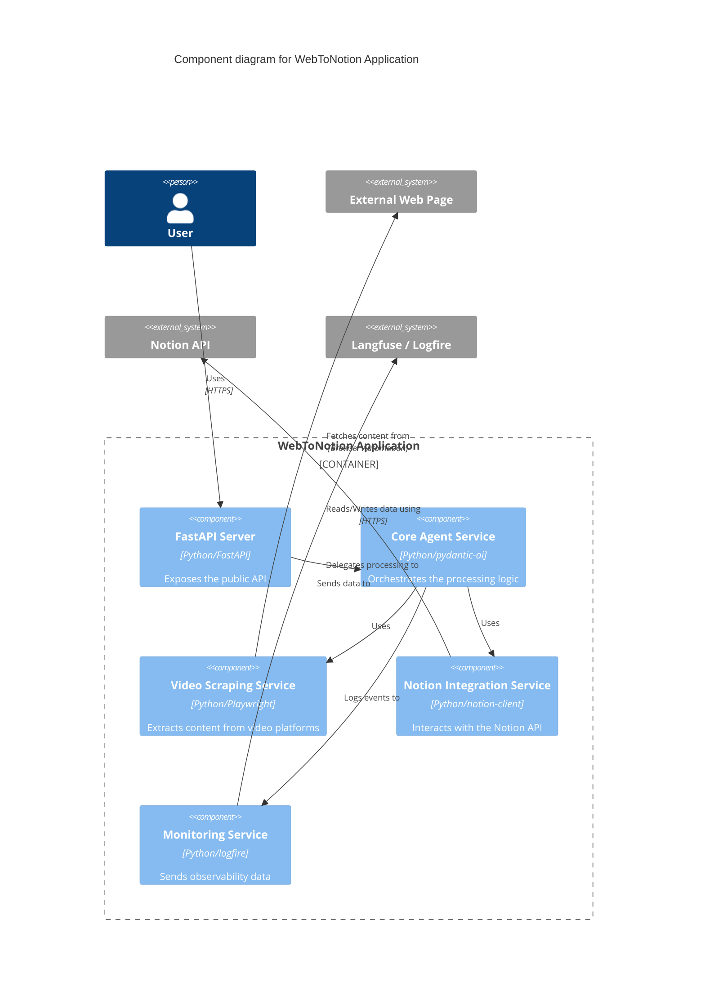

### Component Diagram

```mermaid
C4Component
  title Component diagram for WebToNotion Application

  Person(user, "User")

  Container_Boundary(app, "WebToNotion Application") {
    Component(fas, "FastAPI Server", "Python/FastAPI", "Exposes the public API")
    Component(cas, "Core Agent Service", "Python/pydantic-ai", "Orchestrates the processing logic")
    Component(wss, "Video Scraping Service", "Python/Playwright", "Extracts content from video platforms")
    Component(nis, "Notion Integration Service", "Python/notion-client", "Interacts with the Notion API")
    Component(ms, "Monitoring Service", "Python/logfire", "Sends observability data")
  }

  System_Ext(ext_web, "External Web Page")
  System_Ext(notion_api, "Notion API")
  System_Ext(monitoring_tool, "Langfuse / Logfire")

  Rel(user, fas, "Uses", "HTTPS")
  Rel(fas, cas, "Delegates processing to")
  Rel(cas, wss, "Uses")
  Rel(cas, nis, "Uses")
  Rel(cas, ms, "Logs events to")

  Rel(wss, ext_web, "Fetches content from", "Browser Automation")
  Rel(nis, notion_api, "Reads/Writes data using", "HTTPS")
  Rel(ms, monitoring_tool, "Sends data to")
```