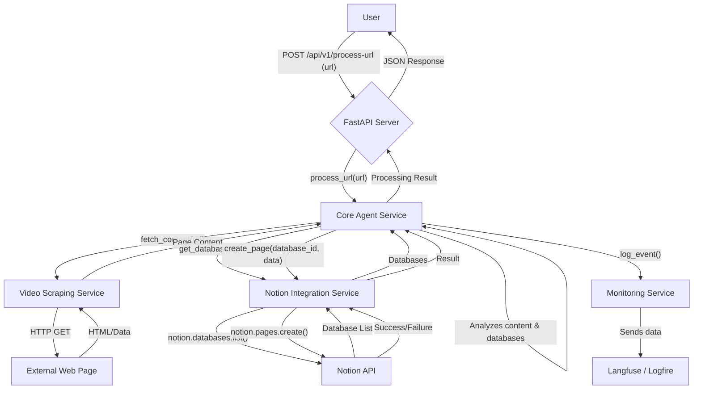

### High-Level Architecture

```mermaid
graph TD
    A[User] -- "POST /api/v1/process-url (url)" --> B{FastAPI Server};
    B -- "process_url(url)" --> C[Core Agent Service];
    C -- "fetch_content(url)" --> D[Video Scraping Service];
    D -- "HTTP GET" --> E[External Web Page];
    E -- "HTML/Data" --> D;
    D -- "Page Content" --> C;
    C -- "get_databases()" --> F[Notion Integration Service];
    F -- "notion.databases.list()" --> G[Notion API];
    G -- "Database List" --> F;
    F -- "Databases" --> C;
    C -- "Analyzes content & databases" --> C;
    C -- "create_page(database_id, data)" --> F;
    F -- "notion.pages.create()" --> G;
    G -- "Success/Failure" --> F;
    F -- "Result" --> C;
    C -- "log_event()" --> H[Monitoring Service];
    H -- "Sends data" --> I[Langfuse / Logfire];
    C -- "Processing Result" --> B;
    B -- "JSON Response" --> A;
```