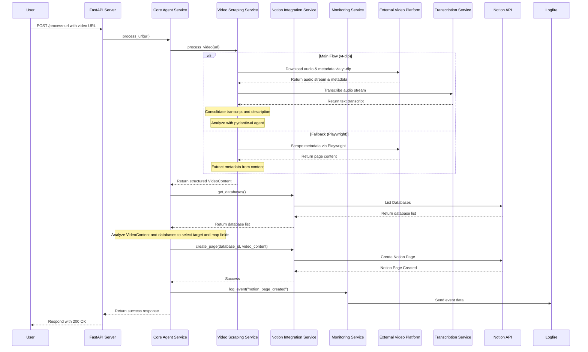

### Sequence Diagram

```mermaid
sequenceDiagram
    participant User
    participant FastAPI_Server as FastAPI Server
    participant Core_Agent_Service as Core Agent Service
    participant Video_Scraping_Service as Video Scraping Service
    participant Notion_Integration_Service as Notion Integration Service
    participant Monitoring_Service as Monitoring Service
    participant External_Video_Platform as External Video Platform
    participant Transcription_Service as Transcription Service
    participant Notion_API as Notion API
    participant Logfire_Platform as Logfire

    User->>FastAPI_Server: POST /process-url with video URL
    FastAPI_Server->>Core_Agent_Service: process_url(url)
    Core_Agent_Service->>Video_Scraping_Service: process_video(url)
    
    alt Main Flow (yt-dlp)
        Video_Scraping_Service->>External_Video_Platform: Download audio & metadata via yt-dlp
        External_Video_Platform-->>Video_Scraping_Service: Return audio stream & metadata
        Video_Scraping_Service->>Transcription_Service: Transcribe audio stream
        Transcription_Service-->>Video_Scraping_Service: Return text transcript
        Note over Video_Scraping_Service: Consolidate transcript and description
        Note over Video_Scraping_Service: Analyze with pydantic-ai agent
    else Fallback (Playwright)
        Video_Scraping_Service->>External_Video_Platform: Scrape metadata via Playwright
        External_Video_Platform-->>Video_Scraping_Service: Return page content
        Note over Video_Scraping_Service: Extract metadata from content
    end
    Video_Scraping_Service-->>Core_Agent_Service: Return structured VideoContent

    Core_Agent_Service->>Notion_Integration_Service: get_databases()
    Notion_Integration_Service->>Notion_API: List Databases
    Notion_API-->>Notion_Integration_Service: Return database list
    Notion_Integration_Service-->>Core_Agent_Service: Return database list

    Note over Core_Agent_Service: Analyze VideoContent and databases to select target and map fields

    Core_Agent_Service->>Notion_Integration_Service: create_page(database_id, video_content)
    Notion_Integration_Service->>Notion_API: Create Notion Page
    Notion_API-->>Notion_Integration_Service: Notion Page Created
    Notion_Integration_Service-->>Core_Agent_Service: Success

    Core_Agent_Service->>Monitoring_Service: log_event("notion_page_created")
    Monitoring_Service->>Logfire_Platform: Send event data

    Core_Agent_Service-->>FastAPI_Server: Return success response
    FastAPI_Server-->>User: Respond with 200 OK
```