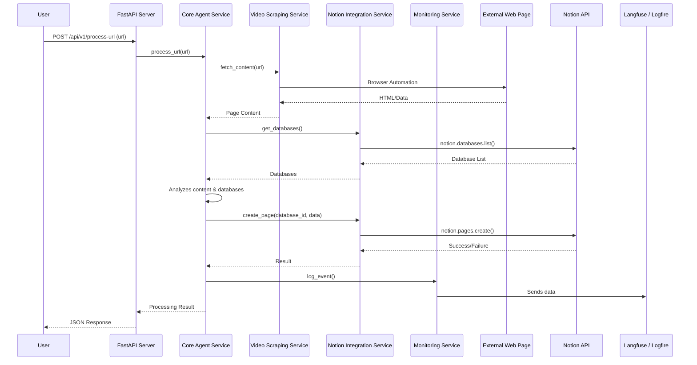

### Sequence Diagram

```mermaid
sequenceDiagram
    participant User
    participant FastAPI Server
    participant Core Agent Service
    participant Video Scraping Service
    participant Notion Integration Service
    participant Monitoring Service
    participant External Web Page
    participant Notion API
    participant Langfuse / Logfire

    User->>FastAPI Server: POST /api/v1/process-url (url)
    FastAPI Server->>Core Agent Service: process_url(url)
    Core Agent Service->>Video Scraping Service: fetch_content(url)
    Video Scraping Service->>External Web Page: Browser Automation
    External Web Page-->>Video Scraping Service: HTML/Data
    Video Scraping Service-->>Core Agent Service: Page Content
    Core Agent Service->>Notion Integration Service: get_databases()
    Notion Integration Service->>Notion API: notion.databases.list()
    Notion API-->>Notion Integration Service: Database List
    Notion Integration Service-->>Core Agent Service: Databases
    Core Agent Service->>Core Agent Service: Analyzes content & databases
    Core Agent Service->>Notion Integration Service: create_page(database_id, data)
    Notion Integration Service->>Notion API: notion.pages.create()
    Notion API-->>Notion Integration Service: Success/Failure
    Notion Integration Service-->>Core Agent Service: Result
    Core Agent Service->>Monitoring Service: log_event()
    Monitoring Service->>Langfuse / Logfire: Sends data
    Core Agent Service-->>FastAPI Server: Processing Result
    FastAPI Server-->>User: JSON Response
```